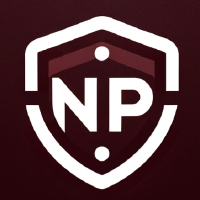
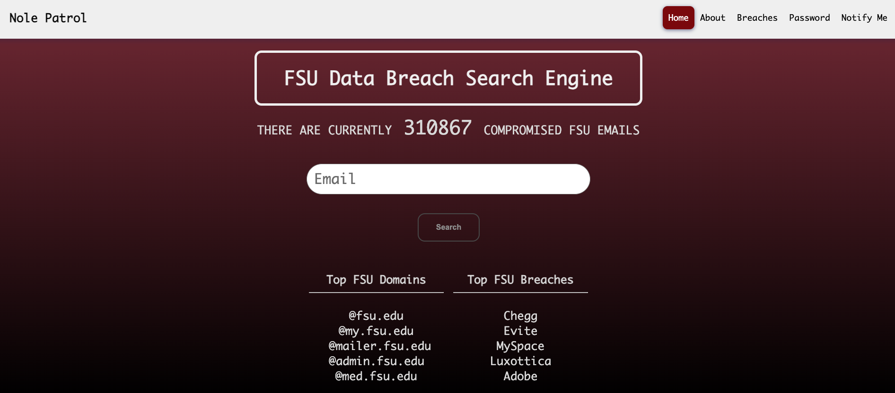

# Nole-Patrol
<!-- Improved compatibility of back to top link: See: https://github.com/othneildrew/Best-README-Template/pull/73 -->
<a name="readme-top"></a>

<!-- PROJECT SHIELDS -->
<!--
*** I'm using markdown "reference style" links for readability.
*** Reference links are enclosed in brackets [ ] instead of parentheses ( ).
*** See the bottom of this document for the declaration of the reference variables
*** for contributors-url, forks-url, etc. This is an optional, concise syntax you may use.
*** https://www.markdownguide.org/basic-syntax/#reference-style-links
-->

[![Contributors][contributors-shield]][contributors-url]
[![Forks][forks-shield]][forks-url]
[![Stargazers][stars-shield]][stars-url]
[![Issues][issues-shield]][issues-url]
[![MIT License][license-shield]][license-url]


<!-- PROJECT LOGO -->
<br />
<div align="center">
  <a href="https://github.com/Nole-Patrol/Nole-Patrol">
    
  </a>

<h3 align="center">Nole Patrol: FSU Data Breach Search Engine</h3>

  <p align="center">
    A data breach search engine for Florida State University
    <br />
    <a href="https://github.com/Nole-Patrol/Nole-Patrol"><strong>Explore the docs »</strong></a>
    <br />
    <br />
    <a href="https://youtu.be/eQQZBNx9fA8">View Demo</a>
    ·
    <a href="https://github.com/Nole-Patrol/Nole-Patrol/issues">Report Bug</a>
    ·
    <a href="https://github.com/Nole-Patrol/Nole-Patrol/issues">Request Feature</a>
  </p>
</div>


<!-- TABLE OF CONTENTS -->
<details>
  <summary>Table of Contents</summary>
  <ol>
    <li>
      <a href="#about-the-project">About The Project</a>
      <ul>
        <li><a href="#built-with">Built With</a></li>
      </ul>
    </li>
    <li>
      <a href="#getting-started">Getting Started</a>
      <ul>
        <li><a href="#prerequisites">Prerequisites</a></li>
        <li><a href="#installation">Installation</a></li>
      </ul>
    </li>
    <li><a href="#roadmap">Roadmap</a></li>
    <li><a href="#contributing">Contributing</a></li>
    <li><a href="#license">License</a></li>
    <li><a href="#disclaimers">Disclaimers</a></li>
    <li><a href="#contact">Contact</a></li>
    <li><a href="#acknowledgments">Acknowledgments</a></li>
  </ol>
</details>


<!-- ABOUT THE PROJECT -->
## About The Project



Students, faculty, staff, and administrators at Florida State University face the risk of data breaches that could leak
sensitive information including credentials associated with their fsu.edu email addresses and associated accounts. Nole
Patrol offers an intuitive data breach search engine that utilizes proprietary code along with third-party APIs to 
identify and catalog leaked fsu.edu credentials from a variety of publicly available sources. Utilize our product to 
search for data breaches affecting FSU email addresses and passwords. Additional functionality includes a custom password 
generator and a notification feature where users can sign-up to receiving automated email notifications when their email
address has been discovered in new breaches.

<p align="right">(<a href="#readme-top">back to top</a>)</p>


### Built With

* [![Python][Python.org]][Python-url]
* [![Django][DjangoProject.com]][Django-url]
* [![SQLite][SQLite.org]][SQLite-url]
* [![HaveIBeenPwned][HaveIBeenPwned.com]][HaveIBeenPwned-url]

<p align="right">(<a href="#readme-top">back to top</a>)</p>


<!-- GETTING STARTED -->
## Getting Started

To get a local copy of our project up and running follow these simple steps.

### Prerequisites

To run this project, you will need to install Python 3.10 or later and set up a Python virtual environment (venv). Please see the official <a href="https://docs.python.org/3/library/venv.html">Python documentation</a> to complete this process.

Once you have installed Python and created and activated your venv, install the following dependencies inside it.
* Django
  ```sh
  python -m pip install Django
  ```

### Installation

1. Clone the repo
   ```sh
   git clone https://github.com/Nole-Patrol/Nole-Patrol.git
   ```
2. Navigate to the Nole-Patrol directory.
3. Install Django and relevant packages.
   ```sh
   pip install -r requirements.txt
   ```
4. Run the following command sequence inside the Nole-Patrol directory to set up the product.
   ```sh
   python manage.py makemigrations
   python manage.py migrate
   ```
5. Run the following command to launch the site on localhost:8000.
   ```sh
   python manage.py runserver
   ```

<p align="right">(<a href="#readme-top">back to top</a>)</p>


<!-- ROADMAP -->
## Roadmap

Our development roadmap includes the following milestones:

- **Milestone 1:** Design and develop efficient data import process and search functionality.
- **Milestone 2:** Implement encryption scheme for stored passwords.
- **Milestone 3:** Add secondary features including email notification system and password generator.
- **Milestone 4:** Improve user interface and user experience.
- **Milestone 5:** Ongoing maintenance and bug fixes.

Feel free to open issues or pull requests related to these milestones.

<p align="right">(<a href="#readme-top">back to top</a>)</p>


<!-- CONTRIBUTING -->
## Contributing

We welcome contributions from the community. If you'd like to contribute to Nole Patrol, please follow these guidelines:

1. Fork the repository.
2. Create a new branch for your feature or bug fix.
3. Make your changes and commit them.
4. Push your changes to your fork.
5. Submit a pull request to the main repository, explaining your changes and why they should be merged.
6. We will review and, if approved, merge your changes.

<p align="right">(<a href="#readme-top">back to top</a>)</p>


## License

Distributed under the MIT License. See `LICENSE.txt` for more information.


<p align="right">(<a href="#readme-top">back to top</a>)</p>


<!-- DISCLAIMERS -->
## Disclaimers

Nole Patrol is a student-developed product and is not affiliated, associated, authorized, endorsed by, or in any way officially connected with Florida State University or any of its subsidiaries or its affiliates. All product and company names are trademarks™ or registered® trademarks of their respective holders. Use of them does not imply any affiliation with or endorsement by them. All data referenced in this product has been acquired from publically available sources including but not limited to public records, public data leaks, and public APIs. For questions or concerns, please see the our contact options below.

<p align="right">(<a href="#readme-top">back to top</a>)</p>


<!-- CONTACT -->
## Contact

[![NolePatrolGmail][NolePatrolGmail.com]][NolePatrolGmail-url]

<p align="right">(<a href="#readme-top">back to top</a>)</p>


<!-- ACKNOWLEDGMENTS -->
## Acknowledgments

* [PyProg](https://github.com/Bill13579/pyprog/releases)
* [HaveIBeenPwned](https://haveibeenpwned.com/)

<p align="right">(<a href="#readme-top">back to top</a>)</p>


<!-- MARKDOWN LINKS & IMAGES -->
<!-- https://www.markdownguide.org/basic-syntax/#reference-style-links -->
[contributors-shield]: https://img.shields.io/github/contributors/Nole-Patrol/Nole-Patrol.svg?style=for-the-badge&color=4B0E0E
[contributors-url]: https://github.com/Nole-Patrol/Nole-Patrol/graphs/contributors
[forks-shield]: https://img.shields.io/github/forks/Nole-Patrol/Nole-Patrol.svg?style=for-the-badge&color=4B0E0E
[forks-url]: https://github.com/Nole-Patrol/Nole-Patrol/network/members
[stars-shield]: https://img.shields.io/github/stars/michaelsousajr/Nole-Patrol.svg?style=for-the-badge&color=4B0E0E
[stars-url]: https://github.com/Nole-Patrol/Nole-Patrol/stargazers
[issues-shield]: https://img.shields.io/github/issues/Nole-Patrol/Nole-Patrol.svg?style=for-the-badge&color=4B0E0E
[issues-url]: https://github.com/Nole-Patrol/Nole-Patrol/issues
[license-shield]: https://img.shields.io/github/license/michaelsousajr/Nole-Patrol.svg?style=for-the-badge&color=4B0E0E
[license-url]: https://github.com/Nole-Patrol/Nole-Patrol/blob/master/LICENSE.txt
[product-screenshot]: static/img/screenshot.JPG
[Python.org]: https://img.shields.io/badge/Python-3776AB?style=for-the-badge&logo=python&logoColor=white
[Python-url]: https://python.org
[DjangoProject.com]: https://img.shields.io/badge/Django-092E20?style=for-the-badge&logo=django&logoColor=white
[Django-url]: https://djangoproject.com
[SQLite.org]: https://img.shields.io/badge/SQLite-003B57?style=for-the-badge&logo=sqlite&logoColor=white
[SQLite-url]: https://sqlite.org
[HaveIBeenPwned.com]: https://img.shields.io/badge/HaveIBeenPwned-2A6379?style=for-the-badge&logo=haveibeenpwned&logoColor=white
[HaveIBeenPwned-url]: https://haveibeenpwned.org
[NolePatrolGmail.com]: https://img.shields.io/badge/Gmail-EA4335?style=for-the-badge&logo=gmail&logoColor=white
[NolePatrolGmail-url]: mailto:nolepatrolproj@gmail.com
